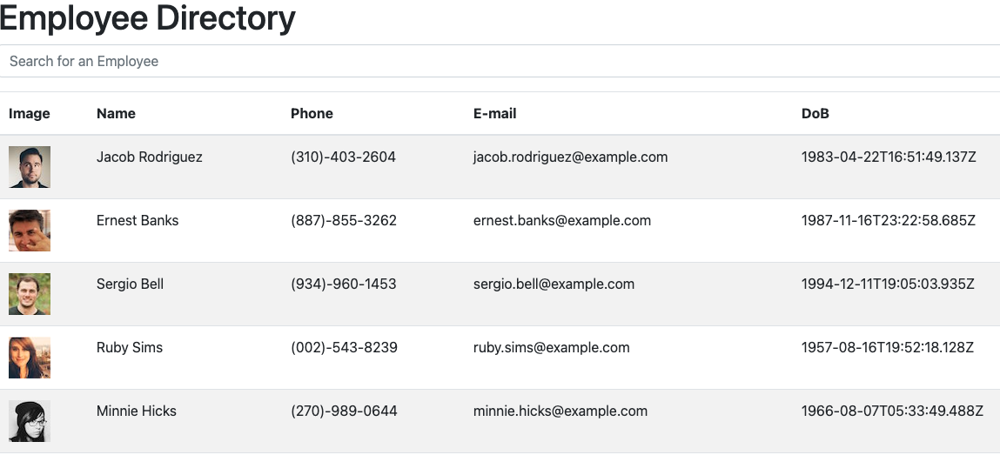

# Employee Directory

## Description
This application keeps track of employees with data generated from the **Random User API**.  Employees are put into a table with columns Image, Name, Phone, Email, and DoB.  You can sort the list by ascending order or search the list of employees.

## Technologies Used
- React.js
- Random User API
- JavaScript
- HTML5 and CSS
- NPM packages: Web-Vitals, Bootstrap, React, Axios

## GitHub Repo
[Employee Directory](https://github.com/HurleySquared/employee-directory)

## Deployed Application
[Deployed Employee Directory](https://hurleysquared.github.io/employee-directory/)

## Screenshot
